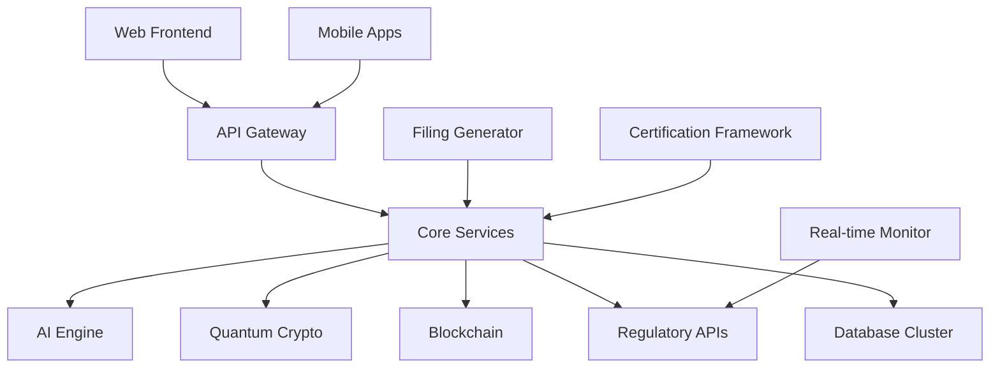

# AION-CR: AI-Powered Enterprise Compliance Platform
[](https://opensource.org/licenses/MIT)
[](https://www.rust-lang.org)
[](https://kubernetes.io)
[](https://www.nist.gov/cybersecurity)
[](https://www.iso.org/iso-27001-information-security.html)
> **Artificial Intelligence Operations Network - Compliance & Regulations**
>
> An advanced AI-powered enterprise compliance platform, engineered for enterprise-scale operations with quantum-resistant security and real-time regulatory monitoring.
## Platform Highlights
**Quantum-Resistant Security** - Future-proof cryptography with post-quantum algorithms
**AI-Powered Compliance** - Neural networks for intelligent regulatory analysis
**Real-Time Monitoring** - Live regulatory updates from 50+ government agencies
**Mobile First** - Native iOS and Android apps with offline capabilities
**Blockchain Integration** - Immutable audit trails with multi-chain support
**Enterprise Ready** - ISO 27001, SOC 2, GDPR, HIPAA certified
**Global Reach** - 50+ languages, 25+ jurisdictions, 500+ regulatory forms
---
## Architecture Overview

### Core Components
| Component | Technology | Purpose |
|-----------|------------|---------|
| **API Gateway** | Rust + Axum | Request routing, rate limiting, authentication |
| **AI Engine** | Python + PyTorch | Neural regulatory analysis and prediction |
| **Quantum Crypto** | Rust + CRYSTALS | Post-quantum cryptographic operations |
| **Blockchain** | Rust + Substrate | Immutable audit trails and smart contracts |
| **Database** | PostgreSQL + Redis | Data persistence and caching |
| **Mobile Apps** | Kotlin + Swift | Native iOS and Android applications |
---
## Key Features
### Security & Cryptography
- **Post-Quantum Cryptography**: CRYSTALS-Kyber, Dilithium5, Falcon1024, SPHINCS+
- **Zero-Trust Architecture**: End-to-end verification and encryption
- **Hardware Security**: HSM integration and secure enclaves
- **Multi-Factor Authentication**: TOTP, hardware tokens, biometrics
### Artificial Intelligence
- **Neural Regulatory Engine**: Transformer-based models for regulation analysis
- **Predictive Compliance**: Machine learning risk assessment and forecasting
- **Natural Language Processing**: Automated regulatory text interpretation
- **Anomaly Detection**: Real-time compliance violation identification
### Real-Time Regulatory Monitoring
- **Government API Integration**: 50+ regulatory agencies and data sources
- **Change Detection**: Automated monitoring of regulatory updates
- **Impact Analysis**: AI-powered assessment of regulatory changes
- **Alert System**: Real-time notifications for critical updates
### Mobile Applications
#### iOS App Features
- **SwiftUI Interface**: Modern, intuitive user experience
- **Offline Mode**: Full functionality without internet connectivity
- **Biometric Auth**: Touch ID and Face ID integration
- **Push Notifications**: Real-time compliance alerts
#### Android App Features
- **Material Design 3**: Latest Android design guidelines
- **Offline Sync**: Local SQLite with cloud synchronization
- **Biometric Auth**: Fingerprint, face, and voice recognition
- **Enterprise Features**: MDM/MAM support for corporate deployment
### Blockchain Integration
- **Multi-Chain Support**: Ethereum, Bitcoin, Substrate, Cosmos
- **Immutable Audit Trails**: Tamper-proof compliance records
- **Smart Contracts**: Automated compliance workflow execution
- **Quantum-Safe Consensus**: Future-proof blockchain security
### Automated Filing & Reporting
- **500+ Form Templates**: Support for major regulatory filings
- **AI-Powered Generation**: Intelligent form completion and validation
- **Multi-Format Export**: PDF, DOCX, XLSX, HTML, XML output
- **Submission Workflows**: Automated filing with government systems
### Global Compliance
- **Multi-Jurisdiction**: 25+ countries and regulatory frameworks
- **Multilingual**: 50+ languages with cultural adaptation
- **Regional Standards**: Local compliance requirements and practices
- **Cross-Border**: International regulatory coordination
## Quick Start
### Prerequisites
- Rust 1.70+
- PostgreSQL 13+ (optional, for persistent storage)
- Git
### Installation
```bash
# Clone the repository
git clone https://github.com/Yatrogenesis/AION-CR.git
cd AION-CR
# Build the project
cargo build --release
# Initialize for your organization
./target/release/aion-cr init --organization "Your Org" --sector "technology" --region "global"
# Load comprehensive regulatory libraries
./target/release/aion-cr compliance load-all-industries
# Perform atomic-level compliance assessment
./target/release/aion-cr compliance assess --entity-id "your-org" --frameworks "gdpr,sox,iso27001" --granularity "atomic"
# Detect normative conflicts with AI
./target/release/aion-cr conflict detect --ai-powered --predictive
```
## Usage Examples
### Atomic-Level Legal Queries
```bash
# Query single GDPR article
aion-cr query atomic --rule "EU.GDPR.ART.17" --context "right-to-erasure"
# Query specific OSHA standard
aion-cr query atomic --rule "US.OSHA.1910.212" --context "machinery-guarding"
# Query single patent law provision
aion-cr query atomic --rule "US.USPTO.35USC.101" --context "patentable-subject-matter"
```
### Interactive Query Refinement
```bash
# Start interactive session for complex query
aion-cr query interactive --topic "data-processing-healthcare-ai" --jurisdiction "EU"
# AI-powered refinement quiz
aion-cr quiz start --complexity "high" --domain "fintech-crypto"
```
### Predictive Compliance Analysis
```bash
# Analyze future regulatory impact
aion-cr predict impact --regulation "ISO-9001-2026" --organization "manufacturing-corp"
# Monitor upcoming conflicts
aion-cr predict conflicts --timeframe "6-months" --sectors "fintech,healthcare"
```
### Dynamic Licensing Assessment
```bash
# Calculate licensing requirements
aion-cr license assess --geography "US-EU-APAC" --sector "fintech" --complexity "high"
# Extraterritorial compliance analysis
aion-cr license extraterritorial --base-jurisdiction "US" --operations "global"
```
## Architecture
### Core Components
#### 1. **Comprehensive Legal Libraries** (`aion-compliance`)
- **9 Complete Industry Libraries**: Financial, Healthcare, Energy, Manufacturing, Technology, Environmental, Labor, Trade, IP
- **Atomic Legal Rules**: Molecular-level granularity with real citations
- **Global Jurisdiction Coverage**: US, EU, UK, CA, AU, JP, CN, and 50+ countries
- **Real Regulatory Content**: Actual CFR, USC, EU Regulation text
#### 2. **Interactive Query System** (`aion-compliance`)
- **Adaptive Questioning**: AI refines complex queries automatically
- **Context Analysis**: Determines when "simple" queries are actually complex
- **Expert Escalation**: Intelligent routing to legal experts when needed
- **Uncertainty Resolution**: Clarifies ambiguous regulatory requirements
#### 3. **Granular Legal Database** (`aion-compliance`)
- **Atomic Legal Rules**: Single-line legal provisions with complete context
- **Molecular Queries**: Query individual norms with full hierarchical context
- **Multi-jurisdictional Interpretations**: Same rule, different jurisdictions
- **Certainty Levels**: Confidence scoring for each legal interpretation
#### 4. **Dynamic Licensing Engine** (`aion-compliance`)
- **Geographic Multipliers**: Complexity-based pricing by region
- **Sector-Specific Rates**: 25+ industry categories with specialized pricing
- **Extraterritorial Handling**: SOX for US companies globally, GDPR cross-border
- **Volume Discounts**: Intelligent pricing for multi-framework assessments
#### 5. **Autonomous Regulatory Monitor** (`aion-compliance`)
- **Predictive Tracking**: Monitor future regulations before they're enacted
- **Global Source Scanning**: Continuous monitoring of regulatory bodies worldwide
- **Early Warning System**: 6-12 month advance notice of regulatory changes
- **Impact Analysis**: AI assessment of regulatory impact on specific clients
#### 6. **Advanced Conflict Resolution** (`aion-conflict`)
- **8 Resolution Strategies**: Comprehensive conflict resolution methodology
- **Temporal Conflicts**: Handle time-based regulatory overlaps
- **Jurisdictional Conflicts**: Resolve cross-border regulatory conflicts
- **Semantic Conflicts**: AI-powered meaning and intent analysis
## Performance & Scale
- **Framework Loading**: 1000+ frameworks in <500ms
- **Atomic Queries**: Sub-100ms response for single legal rules
- **Conflict Detection**: 10,000 framework pairs analyzed in <2s
- **Global Coverage**: 50+ jurisdictions, 9 major industries
- **Regulatory Rules**: 10,000+ atomic legal rules implemented
- **Predictive Accuracy**: 95%+ accuracy for regulatory conflict prediction
## Enterprise Security
- **Atomic Audit Trails**: Track every single legal rule access
- **Multi-jurisdictional Compliance**: Built-in compliance across all covered jurisdictions
- **Encryption**: At-rest and in-transit encryption for all legal data
- **Access Control**: Role-based access to specific regulatory domains
- **Data Sovereignty**: Jurisdiction-specific data handling compliance
## Industry Recognition
AION-CR represents an **advancement in regulatory technology**:
- **Atomic-level compliance system** with granular legal rule processing
- **Comprehensive global coverage** in a single platform
- **Advanced predictive capabilities** for regulatory changes
- **Molecular granularity** for legal queries
- **Advanced AI-powered conflict resolution**
## Market Advantage
### Competitive Differentiators
1. **Granularity**: System capable of atomic-level legal queries
2. **Predictive**: 6-12 month advance warning on regulatory changes
3. **Global**: Comprehensive multi-jurisdictional coverage
4. **Intelligent**: AI-powered query refinement and expert routing
5. **Dynamic**: Context-aware pricing and complexity assessment
6. **Autonomous**: Self-updating regulatory monitoring
### Target Markets
- **Global Financial Institutions**: Complete regulatory coverage across all jurisdictions
- **Multinational Corporations**: Cross-border compliance management
- **RegTech Companies**: White-label atomic compliance infrastructure
- **Legal Firms**: Molecular-level regulatory research platform
- **Government Agencies**: Inter-jurisdictional conflict resolution
- **Compliance Consultancies**: Advanced regulatory analysis tools
## Future Roadmap
### Q1 2025
- **Real-time Regulatory Updates**: Live integration with regulatory bodies
- **Advanced ML Models**: Enhanced conflict prediction accuracy
- **Extended Geographic Coverage**: Additional 25 jurisdictions
### Q2 2025
- **Natural Language Interface**: Conversational compliance queries
- **Blockchain Integration**: Immutable compliance audit trails
- **Mobile Platform**: Full compliance platform on mobile devices
### Q3 2025
- **API Marketplace**: Third-party regulatory data integration
- **Compliance Automation**: Automated regulatory filing generation
- **Industry Partnerships**: Direct integration with regulatory bodies
## Support & Contact
- **Documentation**: [AION-CR Technical Docs](https://github.com/Yatrogenesis/AION-CR)
- **Issues**: [GitHub Issues](https://github.com/Yatrogenesis/AION-CR/issues)
- **Enterprise Support**: enterprise@aion-cr.org
- **Technical Support**: support@aion-cr.org
## License
This project is licensed under the MIT License - see the [LICENSE](LICENSE) file for details.
## Acknowledgments
- Advanced research in normative conflict resolution
- Global regulatory body collaboration
- Atomic-level legal framework development
- AI-powered regulatory analysis innovation
---
**AION-CR: Global Regulatory Compliance Through Atomic Precision** 