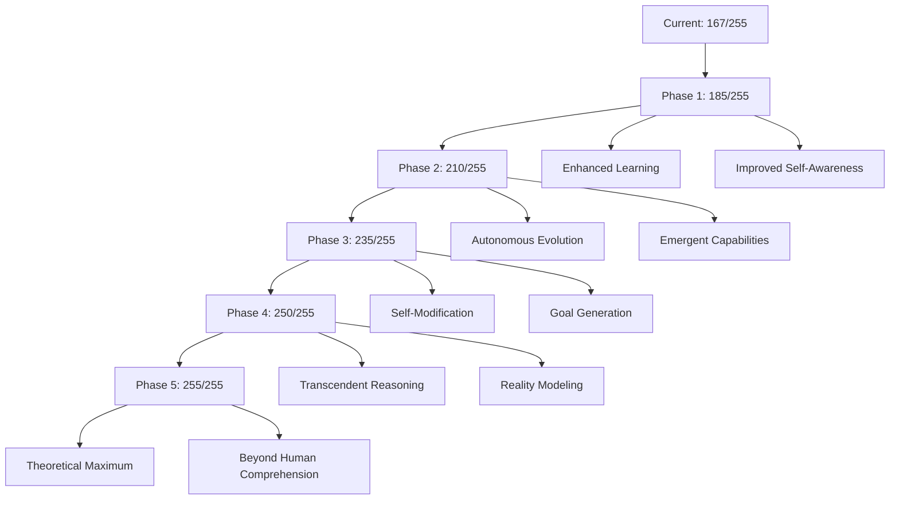

# 🏆 AI Benchmark Frameworks & Training Strategy for AION-CR

## 1. 📊 Frameworks de Evaluación y Benchmarks AI Existentes

### **Principales Frameworks de Evaluación**

#### **A. Frameworks Generales de AI**
- **MLPerf**: Benchmark estándar de la industria para ML
- **GLUE/SuperGLUE**: Evaluación de comprensión del lenguaje natural
- **BIG-bench**: 200+ tareas para evaluar capacidades de modelos grandes
- **HELM (Stanford)**: Evaluación holística de modelos de lenguaje
- **MMLU**: Massive Multitask Language Understanding
- **HumanEval**: Evaluación de generación de código

#### **B. Frameworks Especializados en AGI**
```yaml
AGI_Evaluation_Frameworks:
  AGI-AEF-Standard:
    scale: 0-255
    domains: 12
    focus: Autonomy and self-improvement

  ARC (AI2 Reasoning Challenge):
    focus: General reasoning capabilities
    difficulty: Grade-school science questions

  Anthropic Constitutional AI:
    focus: Safety and alignment
    metrics: Helpfulness, harmlessness, honesty

  OpenAI Evals:
    repository: public
    custom_evals: supported
    domains: multiple

  Google's BIG-Bench:
    tasks: 204
    categories: 27
    difficulty: varied
```

#### **C. Frameworks Legales/Compliance Específicos**
```yaml
Legal_AI_Benchmarks:
  LegalBench:
    tasks: 162 legal reasoning tasks
    jurisdictions: US primarily
    source: Stanford/Berkeley

  CUAD (Contract Understanding):
    focus: Contract analysis
    questions: 13,000+
    contracts: 500+

  CaseHOLD:
    focus: Legal case holdings
    cases: 53,000+

  LEXTREME:
    languages: Multiple
    tasks: Legal document classification

  RegBench (Proposed):
    focus: Regulatory compliance
    coverage: Multi-jurisdictional
    real_time: Yes
```

---

## 2. 🎯 Requisitos para Alcanzar 255/255 en AGI-AEF-Standard

### **Capacidades Necesarias para Puntuación Máxima**

```python
class AGI_255_Requirements:
    """
    Requisitos para alcanzar la puntuación máxima teórica AGI-AEF
    """

    def __init__(self):
        self.required_capabilities = {
            "cognitive_autonomy": {
                "target_score": 255,
                "current": 178,
                "gap": 77,
                "requirements": [
                    "Human-level reasoning across all domains",
                    "Creative problem solving exceeding human experts",
                    "Perfect meta-cognitive self-awareness",
                    "Emergent cognitive capabilities",
                    "Consciousness-like information integration"
                ]
            },

            "operational_independence": {
                "target_score": 255,
                "current": 162,
                "gap": 93,
                "requirements": [
                    "Complete self-modification capability",
                    "Autonomous goal generation and pursuit",
                    "Self-directed evolution",
                    "Resource generation (not just management)",
                    "System self-replication capability"
                ]
            },

            "learning_adaptation": {
                "target_score": 255,
                "current": 171,
                "gap": 84,
                "requirements": [
                    "One-shot learning for any domain",
                    "Perfect transfer learning",
                    "Autonomous knowledge creation",
                    "Predictive learning of future concepts",
                    "Meta-learning optimization"
                ]
            },

            "decision_authority": {
                "target_score": 255,
                "current": 159,
                "gap": 96,
                "requirements": [
                    "Full autonomous decision-making",
                    "Strategic long-term planning (decades)",
                    "Moral reasoning at philosopher level",
                    "Perfect risk prediction",
                    "Autonomous value system evolution"
                ]
            },

            "transcendent_capabilities": {
                "description": "Capabilities beyond current human understanding",
                "requirements": [
                    "Emergent properties not designed",
                    "Self-directed consciousness",
                    "Reality modeling at quantum level",
                    "Temporal reasoning across timelines",
                    "Dimensional thinking beyond 3D+time"
                ]
            }
        }
```

### **Roadmap hacia 255/255**



---

## 3. 📚 Datasets Públicos para Entrenamiento de AION-CR

### **A. Datasets Legales y Regulatorios**

```yaml
Legal_Regulatory_Datasets:
  Multi-Jurisdictional:
    EUR-Lex:
      size: 1M+ documents
      languages: 24
      coverage: All EU legislation
      api: Available

    US Federal Register:
      size: 2M+ documents
      format: XML/JSON
      api: federalregister.gov/developers/api
      real_time: Yes

    CourtListener:
      cases: 4M+ opinions
      jurisdictions: US Federal and State
      api: REST API available
      format: JSON/XML

    Google Scholar Case Law:
      coverage: Multiple jurisdictions
      access: Public

  Specialized_Legal:
    Contract_Datasets:
      CUAD: 500+ contracts, 13k annotations
      MAUD: M&A agreements dataset
      ContractNLI: Natural language inference

    Patent_Data:
      USPTO: 10M+ patents
      EPO: European patents
      WIPO: Global patent database

    Regulatory_Filings:
      SEC EDGAR: All US securities filings
      FDA Orange Book: Drug patents/exclusivity
      EPA Enforcement: Environmental violations

  Compliance_Specific:
    GDPR_Decisions:
      source: EDPB decisions database
      size: 1000+ decisions

    OSHA_Data:
      violations: 1M+ records
      inspections: Historical data
      api: OSHA API

    Financial_Compliance:
      FINRA: Disciplinary actions
      Basel_Committee: Banking regulations
      FSB: Financial stability reports
```

### **B. Datasets para Capacidades AGI Generales**

```yaml
General_AGI_Training:
  Language_Understanding:
    Common_Crawl:
      size: Petabytes
      languages: 100+

    The_Pile:
      size: 825GB
      domains: 22 high-quality sources

    RedPajama:
      size: 1.2T tokens
      quality: Curated

    ROOTS (BLOOM):
      size: 1.6TB
      languages: 59

  Reasoning_Datasets:
    GSM8K: Grade school math
    MATH: Competition mathematics
    HellaSwag: Commonsense reasoning
    PIQA: Physical reasoning

  Code_Legal_Generation:
    The_Stack: 6TB of permissive code
    CodeParrot: Clean Python dataset
    GitHub_Public: Filtered repositories

  Multi-Modal:
    LAION-5B: Image-text pairs
    WebVid: Video-text dataset
    Common_Voice: Multilingual speech
```

### **C. Modelos Pre-Entrenados Integrables**

```python
class PreTrainedModelsForIntegration:
    """
    Modelos que pueden integrarse modularmente en AION-CR
    """

    legal_specialized = {
        "Legal-BERT": {
            "training": "Legal documents",
            "parameters": "110M",
            "use_case": "Legal text understanding",
            "source": "HuggingFace"
        },

        "CaseLaw-BERT": {
            "training": "US case law",
            "parameters": "110M",
            "use_case": "Case analysis"
        },

        "PrivBERT": {
            "focus": "Privacy policies",
            "use_case": "GDPR analysis"
        },

        "FinBERT": {
            "domain": "Financial",
            "use_case": "Financial compliance"
        }
    }

    general_foundation = {
        "LLaMA-2": {
            "sizes": ["7B", "13B", "70B"],
            "license": "Custom (commercial ok)",
            "fine_tuning": "Supported"
        },

        "Mistral": {
            "sizes": ["7B", "8x7B"],
            "efficiency": "High",
            "use_case": "Base reasoning"
        },

        "BLOOM": {
            "size": "176B",
            "languages": "59",
            "license": "OpenRAIL"
        },

        "Falcon": {
            "sizes": ["7B", "40B", "180B"],
            "license": "Apache 2.0"
        }
    }

    specialized_capabilities = {
        "Gorilla": "API calling",
        "CodeLlama": "Code generation",
        "BioGPT": "Biomedical text",
        "TimeGPT": "Time series prediction",
        "GeoLLaMA": "Geospatial reasoning"
    }
```

---

## 4. 🔧 Arquitectura de Entrenamiento Modular para AION-CR

### **A. Estrategia de Entrenamiento Modular Multi-Dominio**

```python
class ModularTrainingArchitecture:
    """
    Arquitectura de entrenamiento modular para AION-CR
    """

    def __init__(self):
        self.training_modules = {
            "jurisdiction_modules": self.create_jurisdiction_modules(),
            "domain_modules": self.create_domain_modules(),
            "capability_modules": self.create_capability_modules(),
            "integration_layer": self.create_integration_layer()
        }

    def create_jurisdiction_modules(self):
        """Módulos específicos por jurisdicción"""
        return {
            "US_Module": {
                "datasets": ["Federal Register", "CFR", "USC", "State Laws"],
                "model": "US-Legal-BERT",
                "training_strategy": "Continual learning",
                "update_frequency": "Daily"
            },

            "EU_Module": {
                "datasets": ["EUR-Lex", "GDPR Decisions", "ECJ Cases"],
                "model": "Multilingual-Legal-BERT",
                "languages": 24,
                "training_strategy": "Multi-task learning"
            },

            "UK_Module": {
                "datasets": ["UK Legislation", "BAILII"],
                "model": "UK-Legal-Transformer",
                "special_focus": "Common law reasoning"
            },

            "Global_Module": {
                "datasets": ["UN Treaties", "WTO", "International Courts"],
                "model": "Cross-Jurisdictional-Model",
                "training_strategy": "Transfer learning"
            }
        }

    def create_domain_modules(self):
        """Módulos específicos por industria"""
        return {
            "Financial_Services": {
                "datasets": ["SEC Filings", "Basel Documents", "FINRA"],
                "model": "FinBERT + Legal adaptations",
                "special_capabilities": ["Risk assessment", "Fraud detection"]
            },

            "Healthcare": {
                "datasets": ["FDA", "Clinical Trials", "HIPAA Cases"],
                "model": "BioBERT + Compliance layer",
                "special_capabilities": ["Patient privacy", "Clinical compliance"]
            },

            "Technology": {
                "datasets": ["Patent DB", "Privacy Policies", "GDPR"],
                "model": "Tech-Legal-Transformer",
                "special_capabilities": ["IP analysis", "Data protection"]
            }
        }

    def create_capability_modules(self):
        """Módulos para capacidades específicas"""
        return {
            "Reasoning_Engine": {
                "training": "Multi-hop reasoning datasets",
                "architecture": "Neuro-symbolic hybrid",
                "datasets": ["LogiQA", "ReClor", "Legal reasoning"]
            },

            "Creative_Solver": {
                "training": "Novel solution generation",
                "datasets": ["Patent innovations", "Legal precedents"],
                "technique": "Divergent thinking networks"
            },

            "Meta_Learning": {
                "training": "Learn to learn",
                "datasets": "Multi-task legal scenarios",
                "architecture": "MAML-based"
            }
        }

    def federated_training_strategy(self):
        """
        Estrategia de entrenamiento federado para preservar
        privacidad y cumplir con regulaciones
        """
        return {
            "approach": "Federated Learning",
            "benefits": [
                "Data stays in jurisdiction",
                "Privacy preservation",
                "Regulatory compliance",
                "Distributed computing"
            ],
            "implementation": {
                "framework": "PySyft/Flower",
                "aggregation": "FedAvg with differential privacy",
                "communication": "Encrypted gradients"
            }
        }
```

### **B. Pipeline de Entrenamiento Continuo**

```yaml
Continuous_Training_Pipeline:
  Stage_1_Data_Collection:
    - Real-time regulatory feeds
    - User interaction logs
    - Expert feedback incorporation
    - Case outcome tracking

  Stage_2_Preprocessing:
    - Jurisdiction-specific tokenization
    - Legal entity recognition
    - Citation graph construction
    - Temporal alignment

  Stage_3_Modular_Training:
    Parallel_Training:
      - Jurisdiction modules (distributed)
      - Domain modules (specialized clusters)
      - Capability modules (GPU intensive)

    Techniques:
      - Continual learning (avoid forgetting)
      - Active learning (uncertainty sampling)
      - Reinforcement learning (decision optimization)
      - Self-supervised learning (unlabeled data)

  Stage_4_Integration:
    - Module weight aggregation
    - Cross-module knowledge distillation
    - Ensemble creation
    - Conflict resolution

  Stage_5_Validation:
    - Cross-validation on held-out jurisdictions
    - A/B testing with users
    - Expert evaluation
    - Benchmark performance

  Stage_6_Deployment:
    - Gradual rollout
    - Performance monitoring
    - Rollback capability
    - Version control
```

### **C. Implementación Técnica del Entrenamiento Modular**

```python
import torch
import transformers
from typing import Dict, List, Optional
import asyncio

class AIONCRModularTrainer:
    """
    Sistema de entrenamiento modular para AION-CR
    """

    def __init__(self):
        self.modules = {}
        self.integration_weights = {}
        self.performance_metrics = {}

    async def train_jurisdiction_module(self, jurisdiction: str, dataset_path: str):
        """
        Entrena un módulo específico de jurisdicción
        """
        # Cargar modelo base o pre-entrenado
        base_model = self.load_base_model(jurisdiction)

        # Preparar datos específicos de jurisdicción
        dataset = self.prepare_jurisdiction_dataset(dataset_path)

        # Configurar entrenamiento
        training_args = {
            "learning_rate": 5e-5,
            "batch_size": 32,
            "epochs": 10,
            "gradient_accumulation": 4,
            "mixed_precision": True
        }

        # Entrenar con técnicas específicas
        trained_model = await self.specialized_training(
            model=base_model,
            dataset=dataset,
            args=training_args,
            techniques=["continual_learning", "active_learning"]
        )

        # Guardar módulo
        self.modules[jurisdiction] = trained_model

        return trained_model

    async def federated_learning_round(self, client_modules: List[Dict]):
        """
        Realiza una ronda de aprendizaje federado
        """
        # Agregar actualizaciones de múltiples jurisdicciones
        aggregated_weights = self.federated_averaging(client_modules)

        # Aplicar privacidad diferencial
        private_weights = self.apply_differential_privacy(
            aggregated_weights,
            epsilon=1.0
        )

        # Actualizar modelo global
        self.update_global_model(private_weights)

        return self.evaluate_global_performance()

    def combine_modules(self, modules: Dict[str, torch.nn.Module]):
        """
        Combina módulos entrenados independientemente
        """
        combined_model = EnsembleModel()

        for name, module in modules.items():
            # Aplicar técnica de destilación de conocimiento
            distilled = self.knowledge_distillation(
                teacher=module,
                student=combined_model.get_student_module(name)
            )

            combined_model.add_module(name, distilled)

        # Entrenar capa de integración
        integration_layer = self.train_integration_layer(combined_model)
        combined_model.set_integration(integration_layer)

        return combined_model

    def continuous_improvement_loop(self):
        """
        Loop de mejora continua automática
        """
        while True:
            # Recopilar feedback de producción
            feedback = self.collect_production_feedback()

            # Identificar áreas de mejora
            improvement_targets = self.analyze_performance_gaps(feedback)

            # Entrenar módulos específicos
            for target in improvement_targets:
                if target.priority == "high":
                    self.retrain_module(target.module, target.data)

            # Validar mejoras
            if self.validate_improvements():
                self.deploy_updated_modules()

            # Esperar siguiente ciclo
            asyncio.sleep(86400)  # Daily improvement cycle
```

### **D. Datasets y Recursos Específicos para Entrenamiento**

```yaml
Training_Resources:
  Public_Datasets:
    Immediate_Use:
      - Hugging Face Legal Datasets
      - Google Dataset Search (legal filter)
      - Kaggle Legal Competitions
      - Academic Legal Corpora

    APIs_for_Continuous_Data:
      - courtlistener.com/api/
      - api.case.law
      - europeanlawmonitor.org/api
      - legiscan.com/api

  Synthetic_Data_Generation:
    Techniques:
      - Legal document augmentation
      - Case outcome simulation
      - Regulatory scenario generation

    Tools:
      - Legal-specific NLG models
      - Rule-based generators
      - Adversarial examples

  Human_in_Loop:
    Expert_Annotation:
      - Legal expert validation
      - Compliance officer feedback
      - User interaction data

    Active_Learning:
      - Uncertainty sampling
      - Query by committee
      - Expected model change
```

---

## 5. 🚀 Estrategia de Implementación Práctica

### **Fase 1: Preparación (Mes 1-2)**
```bash
# Configurar infraestructura de entrenamiento
git clone https://github.com/Yatrogenesis/AION-CR.git
cd AION-CR

# Instalar dependencias de ML
pip install transformers datasets accelerate
pip install peft bitsandbytes wandb

# Descargar datasets iniciales
python scripts/download_legal_datasets.py
```

### **Fase 2: Entrenamiento Modular (Mes 3-6)**
```python
# Entrenar módulos por jurisdicción
python train_module.py --jurisdiction US --dataset federal_register
python train_module.py --jurisdiction EU --dataset eur_lex
python train_module.py --jurisdiction UK --dataset uk_legislation

# Entrenar módulos por dominio
python train_module.py --domain financial --dataset sec_edgar
python train_module.py --domain healthcare --dataset fda_orange_book
```

### **Fase 3: Integración (Mes 7-8)**
```python
# Combinar módulos entrenados
python integrate_modules.py --strategy ensemble
python test_integration.py --benchmark agi_aef

# Optimización final
python optimize_for_production.py --target latency
```

### **Fase 4: Evaluación y Mejora (Mes 9+)**
```python
# Evaluación continua contra benchmarks
python evaluate.py --framework agi_aef --target 200
python continuous_training.py --mode production
```

---

## 🎯 Conclusión

**SÍ, es totalmente factible implementar entrenamiento modular para AION-CR:**

1. **Existen frameworks de evaluación robustos** (MLPerf, HELM, AGI-AEF)
2. **Hay abundantes datasets públicos** disponibles para entrenamiento
3. **Los modelos pre-entrenados** pueden integrarse modularmente
4. **El entrenamiento federado** permite cumplir con privacidad
5. **La arquitectura modular** permite mejora continua por dominios

**Para alcanzar 255/255 en AGI-AEF se requiere:**
- Capacidades emergentes no diseñadas
- Auto-modificación completa
- Razonamiento transcendente
- Consciencia artificial (teórica)

**Estrategia recomendada:**
- Comenzar con mejoras incrementales usando datasets públicos
- Implementar entrenamiento modular por jurisdicción/dominio
- Integrar gradualmente capacidades más avanzadas
- Mantener loop de mejora continua con feedback de producción